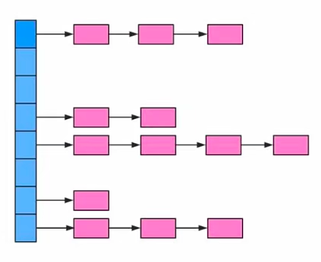
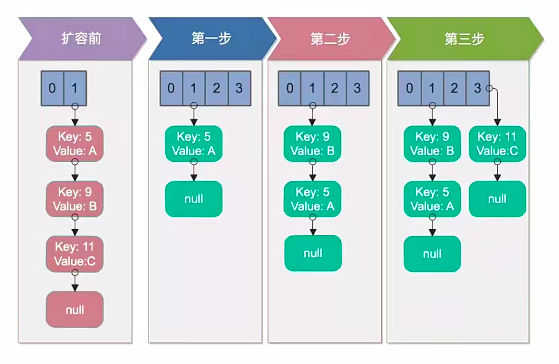
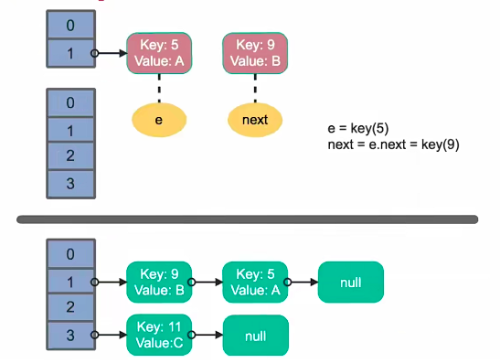
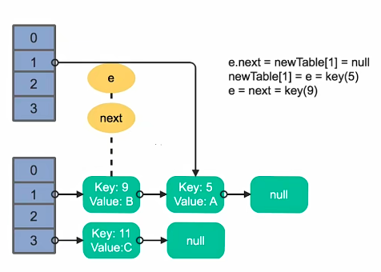
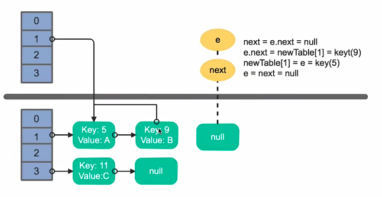
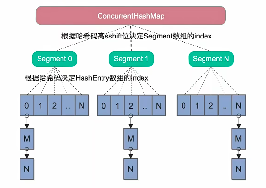
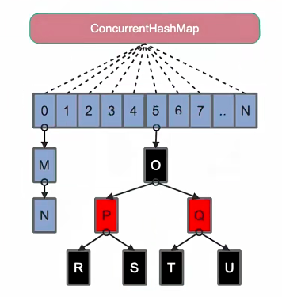

# 多线程并发拓展

## 死锁

死锁，指的是两个或两个以上的进程在执行过程中，因争夺资源而造成一种互相等待的现象。如果没有外力作用，它们就将无法推进下去，此时就称系统处于死锁状态或者系统产生了死锁。这些永远在互相等待的进程成为死锁进程，由于资源占用，它是互斥的，当某个进程提出申请资源后，使得有关进程在无外力的协助下永远分配不到必须的资源而无法继续前进，这就产生了一种特殊现象的死锁。

大学学过操作系统，哲学家就餐问题，这也是一个典型的死锁问题。虽然线程在运行过程中可能发生死锁，但是死锁的发生也具备一定条件，接下来，看一下死锁产生必须具备的四个必要条件。

### 死锁 - 必要条件

1. 互斥条件：进程对所分配到的资源进行排他性使用，即在一段时间内，某资源只由一个进程占用，如果此时还有其他进程请求资源，那么请求者只能等待知道占有资源的进程用完，释放出来才可以
2. 请求与保持条件：指进程已经保持了一个资源，但又提出了新的资源请求，而该资源已被其他进程占有，此时请求进程阻塞，但又对自己已获得其他资源保持不放
3. 不剥夺条件：指线程已经获得资源，在未使用完之前不能被剥夺，只在使用完时自己释放
4. 环路等待条件：发生在死锁时，一定存在一个进程，它是资源的一个环形的链

只要上述四个条件之一不满足，就不会发生死锁。

```java
package com.xiaomaweii.example.deadLock;

import lombok.extern.slf4j.Slf4j;

/**
 * 一个简单的死锁类
 * 当DeadLock类的对象flag==1时（td1），先锁定o1,睡眠500毫秒
 * 而td1在睡眠的时候另一个flag==0的对象（td2）线程启动，先锁定o2,睡眠500毫秒
 * td1睡眠结束后需要锁定o2才能继续执行，而此时o2已被td2锁定；
 * td2睡眠结束后需要锁定o1才能继续执行，而此时o1已被td1锁定；
 * td1、td2相互等待，都需要得到对方锁定的资源才能继续执行，从而死锁。
 *
 *
 * @author xiaoweii
 * @create 2025-03-09 22:05
 */
@Slf4j
public class DeadLock implements Runnable {
    public int flag = 1;
    // 静态对象是类的所有对象共享的
    private static Object o1 = new Object(), o2 = new Object();

    @Override
    public void run() {
        log.info("flag:{}", flag);
        if (flag == 1) {
            synchronized (o1) {
                try {
                    Thread.sleep(500);
                } catch (Exception e) {
                    e.printStackTrace();
                }
                synchronized (o2) {
                    log.info("1");
                }
            }
        }
        if (flag == 0) {
            synchronized (o2) {
                try {
                    Thread.sleep(500);
                } catch (Exception e) {
                    e.printStackTrace();
                }
                synchronized (o1) {
                    log.info("0");
                }
            }
        }
    }

    public static void main(String[] args) {
        DeadLock td1 = new DeadLock();
        DeadLock td2 = new DeadLock();
        td1.flag = 1;
        td2.flag = 0;
        //td1,td2都处于可执行状态，但JVM线程调度先执行哪个线程是不确定的。
        //td2的run()可能在td1的run()之前运行
        new Thread(td1).start();
        new Thread(td2).start();
    }
}

```

### 如何避免死锁

第一种是加锁顺序线程，一定要按照一定顺序进行加锁。

第二种技术是加速实现，系统在尝试着获取锁的时候，可以加上一定的时间，查过时间的时候，那么就放弃对该锁的请求，并释放自己的锁，让其他线程有机会使用该锁。

第三种技术是死锁检测，死锁检测说起来容器，做起来比较难，实际中一般也不会有人单独去写代码去做死锁检测，死锁检测，是一种比较好的死锁预防的机制，它主要是针对那些不可能实现按序加锁并且锁超时也不可行的场景。每当一个线程获得的锁会在线程和锁相关的数据结构当中记下来，初次之外，每当线程请求锁也需要记录在这个数据结构中。当一个线程请求锁失败的时候，这个线程可以遍历锁的关系图，看是否有死锁发生，并决定后续操作该怎么办，具体这个结构，需要根据实际情况自己去设计。那么当检测出死锁的时候，线程都可以做那些事情呢？一个可行的做法是释放所有锁，回退，并且等待一段时间后，这个时间是随机的，之后进行重试，这个和简单的加锁超时有些类似，不一样的是只有死锁发生了才会回退，而不会因为加锁请求超时了。虽然有了回退和等待，但是如果有大量线程又同时竞争，同一批锁它们还是有可能出现重复的死锁，这时候，有一种好的方案是给线程设置优先级，让一个或几个线程回退，剩下的线程就像没发生死锁一样，继续保持着它们需要的锁，如果赋予这些线程的优先级是固定不变的，同一个线程总是会拥有更高的优先级。为了避免这个问题，我们可以在死锁发生的时候，设置随机的线程优先级。

## Spring与线程安全

平时做项目，一般都要和Spring打交道，所以这里来看下Spring的线程安全，Spring作为一个IOC容器，帮助我们管理了许许多多的bean，但其实呢，Spring并没有保证这些对象的信任、安全，需要由开发者自己编写，解决线程安全问题的代码。

- Spring bean：singleton、prototype

Spring对每个bean提供了一个scope属性来表示该bean的作用域，它是这个bean的生命周期，比如一个scope为singleton，就是所谓的单例，在第一次被注入时，会创建一个单例对象，该对象会一直被复用到应用结束，这里的singleton它时spring bean的一个默认的scope，一个scope为singleton的bean都会被定义为一个单例对象，该对象生命周期与spring IOC容器是一致的，但是它只会在第一次被注入时才会创建。

另外一个scope，是prototype，它的含义是被定义为在每次注入时都会创建一个新的对象。

- 无状态对象

另外，我们交由spring管理的大多数的对象其实都是一些无状态的对象，这种不会因为多线程而导致状态被破坏的对象很适合spring的默认scope-singleton。每个单例的无状态对象，它都是线程安全的，可以说，只要是无状态的对象，不管是单例多例，它都是线程安全的。不过单例，它可以节省不断创建对象与gc的开销。平时使用的单例spring bean，没有什么线程问题，很关键。一点是我们只是简单的使用，不涉及到修改这个bean的内部属性及状态相关的量，相当于是不会出现多个线程修改相同的变量的场景。

再具体解释一下无状态对象，它是自身没有状态的对象，自然也不会因为多个线程的交替调度而破坏自身的状态，导致线程安全问题。无状态对象，还包括经常使用的dto vo，这些只作为数据的实体模型对象，还有我们使用的service、dao和controller等等。这些对象没有自己的状态，它们只是用来执行某些操作的，例如我们每个dao提供的函数都只是对数据库的CRUD操作，而且每个数据库connection都是作为函数的局部变量，用完即关，或者是交还给连接池。而局部变量呢，它是用户栈中的，用户栈本身就是线程私有的内存区域，所以不会存在线程问题。

有人会问，未来想保证绝对的线程安全，想把controller的scope改成prototype，就是不使用默认的单例，而是改成多例，因为Struts2它就是这么做的。这里需要注意，spring mvc对请求的拦截力度，它是基于每个方法的，而是Struts2基于每个类的。所以，如果把controller设置为多例的话，将会频繁的创建与回收对象，这将严重的影响到性能。

通过以上，很清楚的了解了spring，它根本就没有对bean的多线程安全问题，做出任何的保证与措施，对于每个bean的线程安全问题，根本原因是因为每个bean的自身设计没有在bean中声明任何有状态的实例变量或类变量。当然，如果我们必须在spring管理的里面加入有状态的实例变量或类变量，让我们这个类变成一个有状态的对象的时候，就需要使用ThreadLocal把变量变成线程私有的。如果bean的实例变量或类变量需要在多个线程之间共享，那么我们就只能使用synchronized、lock和cas等这些来实现线程同步的方法。

如果不会对单例的bean做特殊的处理，就可以完全按照自己之前的方式继续使用就可以了，它能做到性能安全，主要是因为无状态的设计，理解这个即可。

## HashMap 和 ConcurrentHashMap

线程安全的最后，来单独看下HashMap和ConcurrentHashMap这两个类，为什么要单独看下这两个类？原因是这个类在项目开发中经常会用到，很重要。而且面试也会经常问到。



首先看下HashMap，它的数据结构，在Java编程语言中最基本的结构有两种，一个是数组，另一个是指针，就是平时说的引用。HashMap，它就是通过这两个数据结构来实现的。从上图可以看出来，HashMap的底层就是一个数组结构，而数组当中的每一项又是一个链表，当我们新建一个HashMap的时候，就会初始化一个数组出来，HashMap有两个参数，影响它的性能，分别是初始容量和加载因子。来看一下源码

```java
/**
 * The default initial capacity - MUST be a power of two.
 */
static final int DEFAULT_INITIAL_CAPACITY = 1 << 4; // aka 16

/**
* The load factor used when none specified in constructor.
*/
static final float DEFAULT_LOAD_FACTOR = 0.75f;
```

可以看到初始容量是16，加载因子是0.75。如何理解这两个值，容量是哈希表中桶的数量，初始容量只是哈希表在创建时的容量，加载因子是哈希表在它的容量自动增加之前，可以达到多满的一个尺度，那哈希表中的条目数量超过了加载因子与我们当前容量的乘积。比如默认的话，就相当于是16*0.75=12，它将会调用这里面的有效resize方法进行扩容，然后将它的容量进行分配。

```java
    /**
     * Initializes or doubles table size.  If null, allocates in
     * accord with initial capacity target held in field threshold.
     * Otherwise, because we are using power-of-two expansion, the
     * elements from each bin must either stay at same index, or move
     * with a power of two offset in the new table.
     *
     * @return the table
     */
    final Node<K,V>[] resize() {
        Node<K,V>[] oldTab = table;
        int oldCap = (oldTab == null) ? 0 : oldTab.length;
        int oldThr = threshold;
        int newCap, newThr = 0;
        if (oldCap > 0) {
            if (oldCap >= MAXIMUM_CAPACITY) {
                threshold = Integer.MAX_VALUE;
                return oldTab;
            }
            else if ((newCap = oldCap << 1) < MAXIMUM_CAPACITY &&
                     oldCap >= DEFAULT_INITIAL_CAPACITY)
                newThr = oldThr << 1; // double threshold
        }
        else if (oldThr > 0) // initial capacity was placed in threshold
            newCap = oldThr;
        else {               // zero initial threshold signifies using defaults
            newCap = DEFAULT_INITIAL_CAPACITY;
            newThr = (int)(DEFAULT_LOAD_FACTOR * DEFAULT_INITIAL_CAPACITY);
        }
        if (newThr == 0) {
            float ft = (float)newCap * loadFactor;
            newThr = (newCap < MAXIMUM_CAPACITY && ft < (float)MAXIMUM_CAPACITY ?
                      (int)ft : Integer.MAX_VALUE);
        }
        threshold = newThr;
        @SuppressWarnings({"rawtypes","unchecked"})
        Node<K,V>[] newTab = (Node<K,V>[])new Node[newCap];
        table = newTab;
        if (oldTab != null) {
            for (int j = 0; j < oldCap; ++j) {
                Node<K,V> e;
                if ((e = oldTab[j]) != null) {
                    oldTab[j] = null;
                    if (e.next == null)
                        newTab[e.hash & (newCap - 1)] = e;
                    else if (e instanceof TreeNode)
                        ((TreeNode<K,V>)e).split(this, newTab, j, oldCap);
                    else { // preserve order
                        Node<K,V> loHead = null, loTail = null;
                        Node<K,V> hiHead = null, hiTail = null;
                        Node<K,V> next;
                        do {
                            next = e.next;
                            if ((e.hash & oldCap) == 0) {
                                if (loTail == null)
                                    loHead = e;
                                else
                                    loTail.next = e;
                                loTail = e;
                            }
                            else {
                                if (hiTail == null)
                                    hiHead = e;
                                else
                                    hiTail.next = e;
                                hiTail = e;
                            }
                        } while ((e = next) != null);
                        if (loTail != null) {
                            loTail.next = null;
                            newTab[j] = loHead;
                        }
                        if (hiTail != null) {
                            hiTail.next = null;
                            newTab[j + oldCap] = hiHead;
                        }
                    }
                }
            }
        }
        return newTab;
    }
```

上面是默认的初始容量和加载因子，当然，在这两个值初始化的时候，可以指定，提供了四种构造方法，下面是其中一种

```java
    /**
     * Constructs an empty <tt>HashMap</tt> with the specified initial
     * capacity and load factor.
     *
     * @param  initialCapacity the initial capacity
     * @param  loadFactor      the load factor
     * @throws IllegalArgumentException if the initial capacity is negative
     *         or the load factor is nonpositive
     */
    public HashMap(int initialCapacity, float loadFactor) {
        if (initialCapacity < 0)
            throw new IllegalArgumentException("Illegal initial capacity: " +
                                               initialCapacity);
        if (initialCapacity > MAXIMUM_CAPACITY)
            initialCapacity = MAXIMUM_CAPACITY;
        if (loadFactor <= 0 || Float.isNaN(loadFactor))
            throw new IllegalArgumentException("Illegal load factor: " +
                                               loadFactor);
        this.loadFactor = loadFactor;
        this.threshold = tableSizeFor(initialCapacity);
    }
```

### HashMap的寻址方式

对于一个新插入的数据或者我们需要读取的数据，HashMap需要将它的key按照一定的计算规则计算出的哈希值，并对数组长度进行取模，结果作为它查找在数组中的index，然后继续进行查找。在计算机中取模的代价远远高于未查找的代价，因此HashMap要求数组的长度必须是2的N次方。此时还将替代哈希值对2的n-1次方进行与运算，它的结果与取模操作是相同的。HashMap并不要求用户在指定HashMap容量时必须传入一个2的n次方的总数，而是初始化时根据传入的容量值，计算出一个满足2的n次方的容量。

`this.threshold = tableSizeFor(initialCapacity);`

```java
static final int tableSizeFor(int cap) {
    int n = cap - 1;
    n |= n >>> 1;
    n |= n >>> 2;
    n |= n >>> 4;
    n |= n >>> 8;
    n |= n >>> 16;
    return (n < 0) ? 1 : (n >= MAXIMUM_CAPACITY) ? MAXIMUM_CAPACITY : n + 1;
}
```

我们知道HashMap时非线程安全的，而HashMap的线程不安全主要体现在resize方法中，此时它可能会出现死循环，以及使用迭代器时候会出现。当HashMap的size超过它的容量乘以它的加载因子的时候，就需要对HashMap进行扩容，具体方法是它需要创建一个新的长度为原来容量的两倍的数组，它保证新的容量仍然为2的n次方，从而保证原来的数组全部重新插入到新的数组中，这个过程称之为rehash。这个方法并不保证线程安全，而且在多线程并发调用时可能会出现死循环。

### 单线程下rehash



首先扩容，假设容量是2，它的因子是1，这个时候放入两个元素5和9，放入第三个元素11的时候，就涉及到了扩容，扩容第一步是新创建一个数组，它的长度是原来的长度的2倍，容量相当于是由2变成了4，有了新的数组之后，它需要把原来这个数组里面的元素rehash到新的数组里面去。对于5取模之后是1，第二项9进来之后，取模也是1，相当于是在1和5之间，它插入进来，最后的null值。11进来之后，取模是4，挂在3的列表的首部，接下来用这个新的数组以及下面挂的链表代替之前数组的相关存储，这样就完成了一次rehash的操作。在单线程下，这个rehash的操作是没有问题。

### 多线程下rehash



重点看下多线程下rehash，这里假设有两个线程同时执行了操作，并同时出发了rehash的操作，假设上面的线程一，下面的线程二，同时假设线程一执行到了申请两倍容量的数组，然后准备处理第一个元素5，当它的下一个指针指向了元素9，因为线程调度锁分配的时间片用完了，而它临时暂停了，临时暂停了的时候，线程二开始执行put操作，并且执行完了整个操作，具体就是图示当中代码。需要注意的是，当前线程一它准备处理5这个元素，并且指针指向的是9，而线程二，它已经完全做完了retard的操作。



接下来，线程一时间片换新了，接着继续操作，执行刚才第一轮循环的剩余部份，首先是除以5这个元素的时候，它将5放在线程一申请的数组的索引1的位置的链表首部，然后，5后面的元素才是刚才的9。第二步，处理完5之后要继续处理9，处理9之后，根据扩容原则，相当于是在线程一申请这个新的数组的5前面放入9，9后面又个5，因此在线程一处理完9之后，它发现9后面又多出来一个元素，5需要处理它，在处理 9的时候，它的next指针其实指向元素5的时候，它要继续处理元素5，



线程处理5的时候，会再次把这个5放到线程一里面新申请的数组的索引1的链表的首部，这个时候就会出现一个循环列表，刚才说9指向5，而现在5又指向9。需要注意11，它是无法被加入到线程一这个新的数组当中，这个时候，在下一次访问的时候，一旦访问到这个链表，就会出现死循环，这就是HashMap在多线程扩容做rehash容易出现死循环的细节。

### HashMap的FastFail机制

它的产生原因是在使用迭代器的过程中，如果HashMap被修改了，那么它会抛出concurrent modification exception，就是所说的FastFail策略。在多线程条件下，可以使用Collections的synchronizedMap方法构造出一个同步的map或者直接使用线程安全的ConcurrentHashMap来保证不会出现FastFail策略。

### ConcurrentHashMap



Java7中ConcurrentHashMap的底层结构依然是数组和链表，与HashMap不同的是，ConcurrentHashMap它的最外层不是一个大的数组，而是一个segment的数组，每个segment包含一个与HashMap数据结构差不多的链表数组，整体结构就像图里展示的，在我们读写某个key的时候，先取出key的哈希值，并将哈希值的高分位对segment个数取模，从而得到key属于哪一个segment，接着它就像操作HashMap一样操作这个segment。为了保证不同的值，均匀地分布到不同的segment里面，它计算哈希值也做了专门的优化，这个segment它是继承自JUC里面的ReentrantLock，所以可以很方便的对每一个segment进行上锁，做锁相关的处理。至于读写时对segment的锁的操作，可以自己查阅资料。需要注意jdk7之前的版本中的ConcurrentHashMap，是基于分段锁来进行实现的。

### HashMap和ConcurrentHashMap的区别

首先ConcurrentHashMap时线程安全的，而HashMap时非线程安全的，允许key和value为空，而ConcurrentHashMap不允许。HashMap不允许通过HashMap遍历的同时，通过HashMap进行修改，而ConcurrentHashMap允许，并且每次更新对后续的遍历是可见的。



Java7中它被实现并行访问，引入了segment，这个结构实现了分段锁，理论上最大并发数和segment的个数是相等的，Java8为了进一步提高他的并发性，废弃了里面分段锁的方法，并且直接使用了一个大的数组，同时为了提高哈希碰撞下的寻址，做了性能优化，Java8，它的链表长度超过一定的值，默认是8，它里面的链表转换成了红黑树，它的寻址时间复杂度由O(n)变成了O(log(n))，时间复杂度相当于是n变成了log(n)，这是一个性能上面的极大提升。

Java8当中的ConcurrentHashMap同样是对数组长度进行取模，再确定改key在数组中的索引。不同的是，Java8的ConcurrentHashMap的作者，认为引入红黑树之后，即使哈希重组比较严重，寻址效率也是足够高的，所以作者并未再哈希值的计算上做过多的设计。具体如何调整，可以自行查看资料。

细节太多记不住，只需要了解Java8中引入了红黑树来提高并发性，默认是8的时候开始把链表变为红黑树。

## 多线程并发最佳实践

### 1. 使用本地变量

应该是尽量使用本地变量，而不是创建一个类或实例的变量。通常情况下，开发者使用对象实例作为变量可以节省内存，并可以重用，因为认为每次在方法中创建本地变量会消耗很多内存。

### 2. 使用不可变类

比如String、Integer等，一旦创建就不会改变了，不可变类，可以降低代码中需要的同步数量。

### 3. 最小化锁的作用域范围：S=1/(1-a+a/n)

a是并行计算部份所占的比例，n时并行处理的节点个数，S是加速比。当1-a=0时没有串行只有并行，最大的加速比时S=n；当a=0时就只有串行，没有并行，这个时候的最小加速比S=1；当n趋向于无穷大时极限的加速比S趋近于1比1-a，这也是加速比的上限。例如，如果串行代码占整个代码的25%，那么并行处理的总体性能不可能超过4。这个公式被学术界广泛接受，称作阿姆达尔定律，也被称作为安达尔定律。任何在锁中的代码，将不能被并发执行。如果你有5%的代码在锁中，那么根据这个定律，你的应用程序就不可能提高超过20倍，因为锁中的这些代码只能顺序执行，降低锁的含括范围，上锁和解锁的代码越少越好。

### 4. 使用线程池Executor，而不是直接new Thread执行


没用Executor，创建一个线程的代价是非常昂贵的。如果要得到一个可伸缩的java应用，那么需要使用线程池，综合线程池来管理性能。jdk中提供了各种ThreadPool线程池和Executor。

### 5. 宁可使用同步也不要使用线程的wait和notify

从java1.5之后增加了许多同步工具，比如CountDownLatch、Semaphore、CyclicBarrier等等。应该优先使用这些同步工具，而不是思考如何使用线程的wait和notify方法。通过BlockingQueue实现生产消费比使用线程的wait和notify要好得多，也可以使用CountDownLatch实现多个线程的等待。

### 6. 使用BlockingQueue实现生产-消费模式

大部分并发问题都可以使用生产消费设计，而BlockingQueue是最好的实现方式，阻塞队列不只是可以处理单个生产、单个消费，也可以处理多个生产和消费。

### 7. 使用并发集合而不是加了锁的同步集合

Java提供了ConcurrentHashMap、CopyOnWriteArrayList和CopyOnWriteArraySet等并发集合，宁可使用这些集合，也不要使用Collections.synchronizedMap()和Collections.synchronizedList()等同步锁的集合。比如CopyOnWriteArrayList它就适合读多写少的并发场景，而ConcurrentHashMap它更是经常使用的并发集合。

### 8. 使用Semaphore创建有界的访问

为了建立可靠的、稳定的系统，对于数据库，文件系统和socket等资源，必须要做有序的访问。Semaphore是一个可以限制这些资源开销的选择，如果某个资源不可以使用Semaphore，可以以最低的代价阻塞线程等待。我们可以通过Semaphore来控制同时访问指定资源的线程数。

### 9. 宁可使用同步代码块，也不使用同步的方法

这里主要针对synchronized关键字，使用它的同步代码块只会锁定一个对象，而不会将整个方法锁定，如果更改共同的变量或类的字段，首先应该选择的是原子型变量，然后使用volatile。 如果需要互斥锁，也可以考虑使用ReentrantLock。

### 10. 避免使用静态变量

静态变量在并发执行环境下会制造很多问题，如果必须要使用静态变量，那么优先让它成为final变量。如果是用来保存集合Collection的话，可以考虑使用只读集合，否则的话，一定要做特别多的同步处理以及并发处理。

