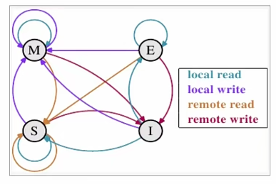

# CPU 多级缓存

下面这张图展示了最简单的高速缓存的配置

数据的读取和存储都经过高级缓存，CPU核心与高速缓存之间有一条特殊的快速通道。在这个简化的图里，主存与高速缓存都连在系统总线上，这条纵线同时还用于其他组件的通信。

在高速缓存出现后不久，系统变得更加复杂。高速缓存与主存之间的速度差异被拉大，直到加入了另一级的缓存。新加入的缓存比第一级缓存更大，但是更慢。由于加大一级缓存的做法从经济上考虑是行不通的，所以又了二级缓存，甚至现在的有些系统已经拥有了三级缓存。

- **为什么需要CPU cache：**
  CPU的频率太快了，快到主存跟不上，这样在处理器时钟周期内，CPU常常需要等待主存，浪费资源。所以cache的出现，是为了缓解CPU和内存之间速度的不匹配问题（结构：cpu ->
  cache -> memory）。
- **CPU cache有什么意义：** （既然缓存不能包含CPU所需要的所有数据，那么缓存的存在真的有意义吗？下面从局部性原理出发）
    - 1）时间局部性：如果某个数据被访问，那么在不久的将来它很可能被再次访问。
    - 2）空间局部性：如果某个数据被访问，那么与它相邻的数据很快也可能被访问。

# CPU 多级缓存 - 缓存一致性（MESI）

MESI是一个协议

- 用于保证多个CPU cache之间缓存共享数据的一致性。

## MESI四种状态

定义了cache line的四种状态，而CPU对cache的四种操作可能会产生不一致的状态。因此，缓存控制器监听到本地操作和远程操作的时候，需要对地址一定的开始栏状态做出一定的修改，从而保证数据在多个缓存之间流转的一致性。MESI其实是四个状态的缩写，这里的m代表的是modified，指的是被修改；e代表的是exclusive，指的是是独享；s代表的是shared，指的是共享；i代表的是invalid，指的是无效

m
的含义是被修改，它指的是该缓存行只被该CPU的缓存中，并且是被修改过的，即与主存中的数据不一致，该缓存行中的内存需要在未来的某个时间点（允许其他CPU读取主存中该缓存行的最新数据）写回主存，这个时间点我们是允许其他CPU读取主存中相应的内存。之前当者里边的值被写回主存之后，该缓存行的状态，它会变成
e，这个状态就是独享。

e 独享状态，它指的是该缓存行只被该CPU缓存中，并且没有被修改过，与主存中数据一致，这个状态可以在任何时刻当有其他CPU读取该内存时变成共享状态，就是s状态，同样的，当CPU修改该缓存行的内容时，该状态可以变成modified状态。

s 共享状态，它意味着该缓存行可能被多个CPU进行缓存，当有一个CPU修改该缓存行的时候，其他CPU中该缓存行是可以被作废的，变成invalid状态，就是无效状态。

i 无效状态，它意味着该缓存行是无效的，可能是其他CPU修改了该缓存行，导致不能够提供任何服务。

## 四种操作

分别是local read、local write、remote read、remote write

local read 代表读本地缓存中的数据。

local write 代表将数据写到本地的缓存中。

remote read 代表将内存中的数据读取出来。

remote write 代表将数据写回到主存当中去。

mesi这个协议，它的cache line数据状态有四种状态，引起数据状态发生改变的操作也是有四种。因此，要完整的理解MESI这个协议，本质上就是要将这16种状态转换的情况讨论清楚。状态之间的相互转换关系可以使用下图进行表示。

 

简单说一下，在一个典型的多核系统中，每一个核它都会有自己的缓存来共享主存总线，每个相应的CPU它会发出读写请求。而缓存的目的是为了减少CPU读写共享存储的次数，一个缓存除了在invalid状态之外，都可以满足CPU的读请求，比如我们看到这个图当中，里面的local read和我们的remote read除了在i状态下，这些值它都是可以进行读取的。我们看到线，从哪开始的到哪里结束。一个写请求，只有在该缓存行是m状态或者是e状态的时候才能够被执行。如果当前状态处于s状态的时候，它必须先将这个缓存中的该缓存行变成无效的状态。这个操作它通常作用于广播的方式来完成，这个时候，它既不允许不同的CPU同时修改同一个缓存行，即使修改该缓存行不同的位置的数据，也是不允许的。

这主要是解决缓存一致性的问题。可以看到图中local read和remote read，对应的一个是紫色的线一个是红色的线，只有在m状态或者e状态下才允许执行，如果是s状态的话，需要变成invalid状态。一个处于m状态的缓存行，它必须时刻监听所有试图读该缓存行相对旧主存的操作。这种操作，它必须在缓存，将该缓存行写回到主存，并将状态变成s状态之前被延迟执行。一个处于s状态的缓存行，它也必须监听其他缓存，使该缓存行无效或者独享该缓存行的请求，并将状态变成无效。而一个处于e状态的缓存行，它要监听其他缓存读缓存中，该缓存行的操作，一旦有该缓存行的操作，那么它需要变成s的状态。因此对于m和e两种状态而言，它的数据总是精确的，它们在和缓存行的真正状态是一致的，而s状态可能是非一致的。如果一个缓存将处于s状态的缓存行作废了，另一个缓存实际上可能已经独享了该缓存行，但是该缓存却不会将缓存行升迁为e状态，这是因为其他缓存不会广播，它们做废掉该缓存行的通知。同样，由于缓存并没有保存该缓存行的copy的刷量，因此也没有办法确定自己是否已经独享了该缓存行。

从上面的意义上来看，这个e状态，它更像是一种投机性的优化，因为如果一个CPU想修改一个处于s共享状态的缓存行，总线事务需要将所有该缓存行copy的值变成invalid，而修改e独享状态的缓存，它却不需要使用总线事务。

# CPU 多级缓存 - 乱序执行优化

- **乱序执行优化：处理器为提高运算速度而做出违背代码原有顺序的优化**

举个例子，这里要计算`a*b`，a等于10，b等于200，得到结果是2000，这个时候我们最开始的代码可能是先写的a等于10，之后写的b等于200，最后计算的是`a*b`，然后在CPU的乱序执行优化的时候，代码可能会变成，先执行的b等于200，之后执行的是a等于10 ，最后再计算`result=a*b`。

这个计算过程中，正常来说，它是不会对结果造成影响的。在单核时代，处理器保证做出的优化不会导致执行的结果远离预期目标，但是在多核环境下并非如此。首先，在多核时代，同时会有多个核执行指令，每个核的指令都可能被乱序执行。另外，处理器还引入了l1l2等缓存机制，每个核都会有自己的缓存，这就导致了逻辑次序上后写入内存的数据未必真的最后写入。最后带来这样一个问题，如果我们不做任何防护措施，处理器最终得出的结果和我们逻辑得出的结果大不相同，比如我们在一个核上执行数据写入操作，并在最后写一个标记，用来表示之前的数据已经准备好了，然后，从另外一个核上通过判断这个标志来判定所需要的数据是否已经就绪，这种做法，它就存在着一定的风险，标记位先被写入，但是之前的数据操作却并未完成，这个未完成，可能是没有计算完成，也可能是数据没有从处理器缓存刷新到主存当中，最终导致了另外一个核使用了错误的数据。

总之，为了提高速度，乱序执行优化，会让我们代码的执行顺序发生变化，但是在多核时代，它会带来一些问题。