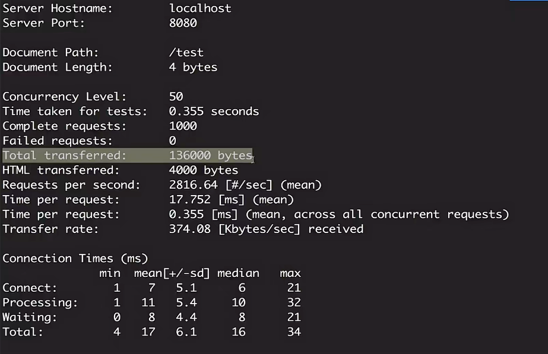
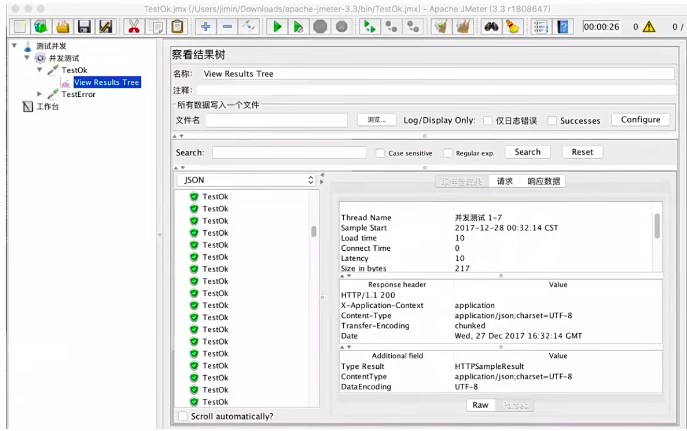
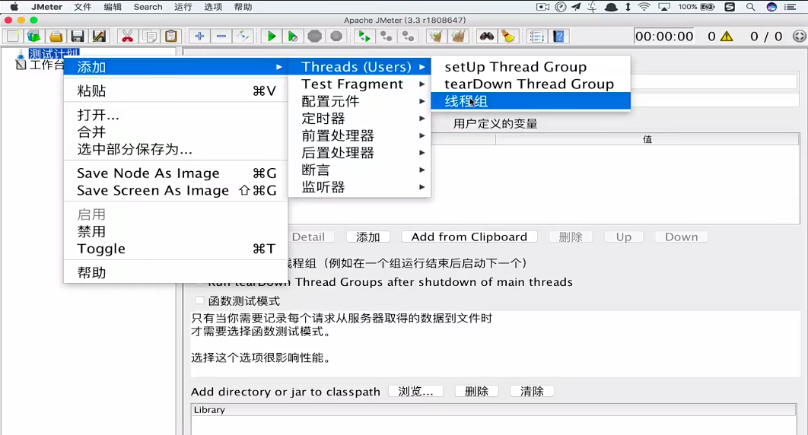
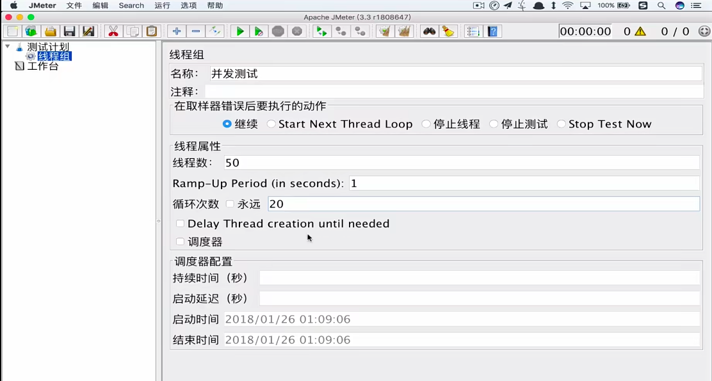
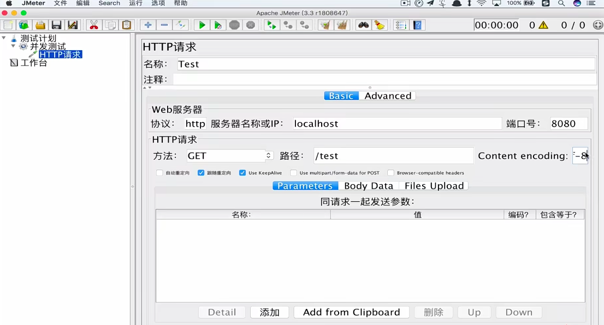
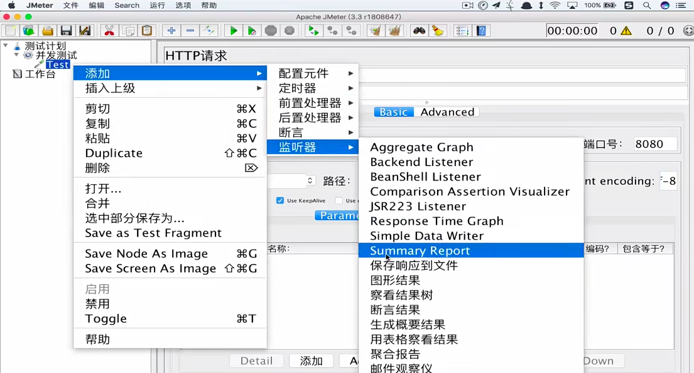
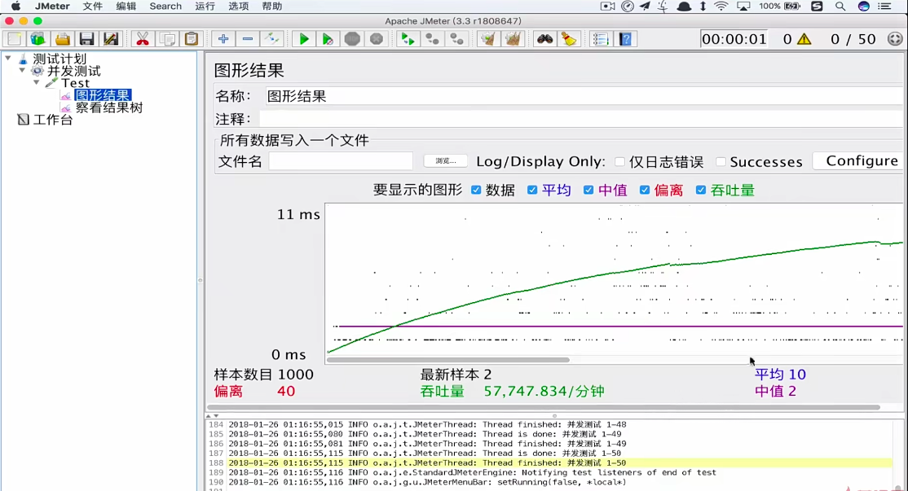
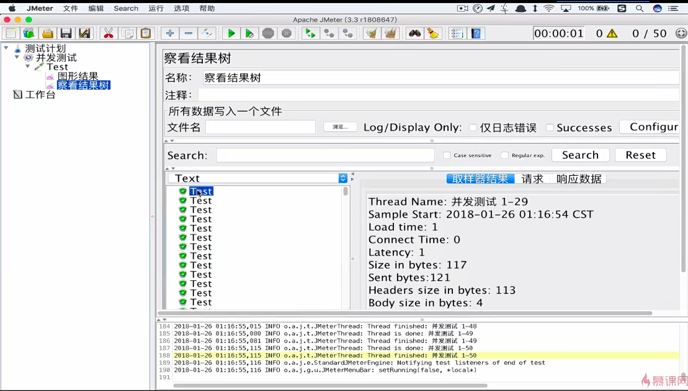
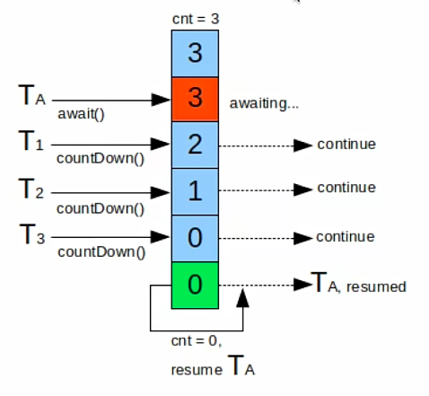

# 并发模拟

- Postman：Http请求模拟工具
- Apache Bench（AB）：Apache附带的工具，测试网站性能
- JMeter：Apache组织开发的压力测试工具
- 代码：Semaphore、CountDownLatch等

## postman

## apipost

## Apache Bench（AB）

AB是一个命令行工具，它对发起服务的本机要求很低，根据AB命令，可以创建很多的并发访问线程，模拟多个访问者同时对某一个URL地址进行访问。因此它可以用来测试目标服务器的负载压力，总的来说AB工具，小巧简洁，可以提供需要的性能指标，但是没有图形化界面，也不能监控，通过AB指定命令发送请求后，可以得到每秒传送的字节数，每次处理请求的时间以及每秒处理请求数等统计数据。

`-n 1000` 代表此次请求是1000次
`-c 50` 代表50个并发数

- Total transferred表示所有请求的响应数据
- HTML transferred表示所有请求响应数据中正文数据总和，正文数据也就是减去了total中http响应数据中的头信息的长度
- Requests per second表示每秒处理请求数，就是吞吐率，也就是qps，注意吞吐率是与并发数相关的，即使请求总数相同，但是如果并发数不一样，吞吐率还是很可能有很大差异的。计算公式是拿到complete requests比time taking for tests
- Time per request表示用户平均请求等待时间，注意这个时间是包含连接时间的，也就是说如果并发数为10，那么每次请求的时间就是100ms/10=10ms；还有一个服务器平均等待时间；
- Transfer rate表示每秒传输速率，计算公式是total transferred/time taking for tests

## JMeter

安装，mac使用jmeter.sh，window使用jmeter.bat，`sh jmeter.sh`运行

第一步，添加线程组

核心是线程属性当中的三个属性，线程数指的是虚拟用户数，默认是1，表明模拟一个虚拟用户访问被测系统，如果想模拟100个用户，直接输入100就可以了；Ramp-Up Period（in seconds）表示虚拟用户增长时长，比方说现在测试一个考勤系统，那么实际用户登录使用考勤系统的时候并不是大家同一时刻同时点击登录，而是从八点半开始，考勤系统才会陆续有人登录，知道九点十分左右，那么完全按照用户的使用场景设计，该测试的时候，此处就应该输入的是40分钟乘以60秒等于2400s，按照这个场景，但是实际测试一般不会设置如此长的时间，原因很简单，做一次测试要等上40分钟，做登录操作有点不现实，一般操作下，要估出登录频率最高的时间长度，比如这里可能是从八点五十五到九点登录的人最多，那么这里就可以设置成300s，如果这是线程数是50，就意味着五分钟之内100个用户登录完毕，演示不做设置；循环次数，这里面设置的是一个虚拟用户，做多少次测试，默认为1，代表一个虚拟用户，做多少次测试，做完一次操作之后停止运行，如果选择永远，意味着测试一旦运行起来之后根本停不下来，除非强制停止。

这里还需要设置下监听器，监听器就是用来监听测试结果的，比如查看测试结果的响应时间，响应码，响应数据等信息，一般有两种，一种是聚合报告，一种是图形化报告，聚合报告就是一个表格，图形化报告就是一个图形，一般来说，图形化报告更直观，但是聚合报告也可以查看测试结果，所以一般来说，两种报告都需要设置。

图形结果

结果树

## 并发模拟 - 代码：CountDownLatch

向下减

我们可以看到，countDownLatch.await()方法会阻塞当前线程，直到计数器的值为0，才会继续执行当前线程。

## 并发模拟 - 代码：Semaphore

可以类比下图，或者高速公路的收费口的示例来理解信号量

> 加入一条公路上只有两个车道，那么同一时间最多只有两辆车能通过同一个点，当两辆车中的任何一辆车让开之后呢，其中等待的车又可以继续通过了。

Semaphore可以阻塞进程，并且可以控制同一时间的并发量

CountDownLatch和Semaphore通常在使用的时候，会放在线程池当中使用，CountDownLatch比较适合保证线程执行完之后再继续其他的处理，而Semaphore更适合控制同时并发的线程数。因此，如果想模拟并发测是的时候，并在所有线程执行完输出一些结果，使用这两个线程结合起来是最好的。

