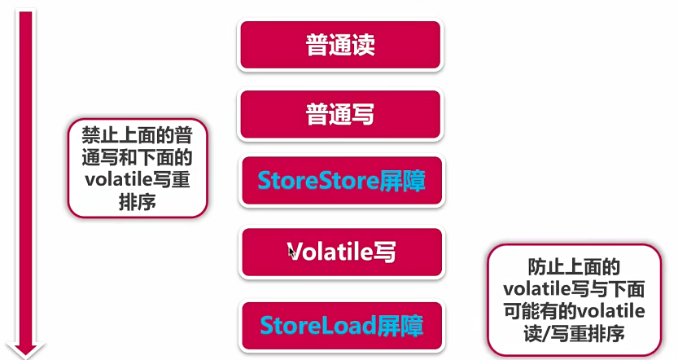
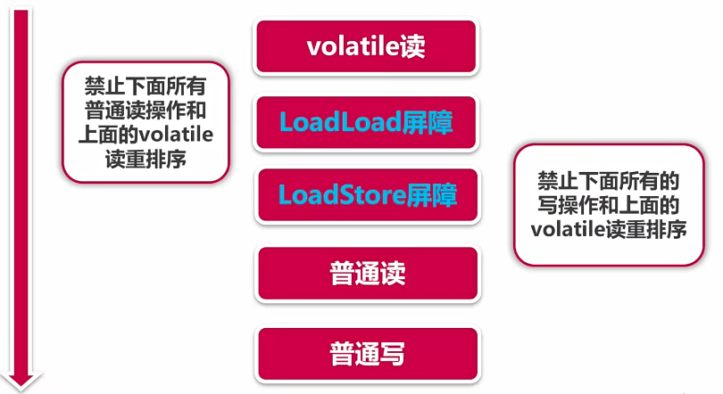
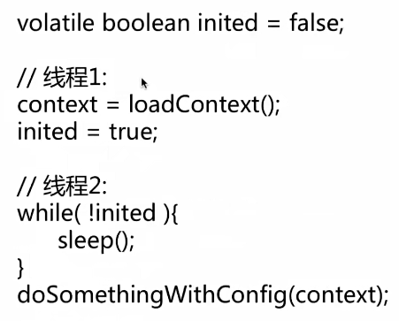

# 线程安全性-可见性

可见性，是一个线程对主内存的修改，可以及时的被其他线程观察到。

说起可见性，经常联想到不可见性，什么是不可见性呢？导致线程间不可见的原因总共分为三方面，第一方面是线程交叉执行；第二方面是重排序结合线程交叉执行；第三方面是共享变量，更新后的值没有在工作内存与主存间及时更新。结合Java内存模型，者三个问题很容易理解。

- 线程交叉执行
- 重排序结合线程交叉执行
- 共享变量更新后的值没有在工作内存与主存间及时更新

<hr>

对于可见性Java提供了synchronized和volatile

## synchronized

JVM关于synchronized的两条规定：

- 线程解锁前，必须把共享变量的最新值刷新到主内存中
- 线程加锁时，将清空工作内存中共享变量的值，从而使用共享变量时需要从主内存中重新读取最新的值 （注意：加锁与解锁是同一把锁）

如何理解加锁解锁过程？我们在原子性的synchronized当中，看到了四种修饰方法，修饰方法的前两条是针对调用对象的，对于不同的对象，它们其实的锁范围是不一样的，这个时候呢，如果不是同一把锁，它们互相之间是不影响的。正因为有了synchronized的可见性及之前的原子性，因此在做线程安全同步时候，只要使用synchronized进行修饰之后，我们的变量可以放心使用。

## volatile

volatile是Java虚拟机提供的轻量级的同步机制

通过加入**内存屏障**和**禁止重排序**优化来实现的。

- 对volatile变量写操作时，会在写操作后加入一条store屏障指令，将本地内存中的共享变量值刷新到主内存中
- 对volatile变量读操作时，会在读操作前加入一条load屏障指令，从主内存中读取共享变量

volatile可以保证可见性，但是不能保证原子性。

### volatile写



它的作用是禁止上面的普通写和下面的volatile写进行重排序，之后会在volatile写之后插入一个store屏障，作用是防止上面的volatile写与可能有的volatile读或者写进行重排序。

### volatile读



当遇到volatile读的时候，会插入Load的屏障，具体首先插入一个LoadLoad的屏障，LoadLoad屏障的作用是禁止下面所有的读操作和上面的volatile读进行重排序。接下来会插入的是LoadStore屏障，LoadStore屏障的作用是禁止下面所有的写操作和上面的volatile读发生重排序。所有的这些，都是在CPU指令级别进行操作，因此，当我们使用volatile的时候，它已经具备了。当前所有的这些规范插入了这么多的屏障来保证线程的可见性。

如果使用volatile去修饰之前计数器的值，是否能出来一个线程安全的结果呢？

修饰count之后运行，发现即使使用了volatile，也不能保证线程的安全性。每次执行++之前都先取出来当前总内存里面存的值，但是我们依然无法保证线程安全，这是为什么呢？

分析一下，当我们执行count++操作的时候，其实分了三步，第一步是从主内存中取出当前count的值，这个时候值已经是最新的。接下来又执行了两步操作，分别是+1和重新写回主存。这时候问题就来了，假设我们现在又两个进程，同时在运行count++操作，两个内存同时都执行了第一步，它们比如说当前count为5，然后两个线程分别执行了加一操作，并写回主存，尽管在第一步读取的时候，它们都拿到了最新值，但是他们同时把自己加1后的值写回了主存，这样的话就丢掉了一次加一操作。这样依赖，发现有的时候计算了加了5000次的结果，但是实际上肯能比5000小，有时候还会小的多。

这个例子当中确认了一件事，首先使用volatile直接做这种加操作，不是线程安全的，同时，也说明了volatile这个关键字不具有原子性，既然volatile不适合计数这个场景，看一下volatile适合什么样的场景？



```java
volatile boolean inited = false;

//线程1:
context = loadContext();
inited = true;

//线程2:
while(!inited) {
    sleep()
}
doSomethingwithconfig(context);
```

通常来说，使用volatile必须具备两个条件，第一个是对变量的写操作不依赖当前值，第二个是该变量没有包含在具有其他变量的不变式中。因此，volatile它特别适合作为状态标识量的一个例子。

例子当中，就是volatile作为状态标识量，我们使用volatile来修饰一个共享的变量inited用来标识线程应该做的初始化是否已经完成，比方说现在有两个线程来执行，线程1取负责初始化，线程2负责执行，而线程2执行的时候必须保证初始化已经完成，这个时候，inited派上用途了。首先，之前它先同步执行一个初始化的过程，在初始化完毕的时候修改这个标识为初始化完成，然后线程2的执行，会不断的判断当前这个inited是否为true，如果线程1在把inited变成true的时候，这边线程2就会立刻知道，上边的初始化已经完成，然后走到下面这个操作里来，这时候线程2去使用，已经初始化好context，也不会出问题了。

volatile还有一个场景叫做double check，字面上的意思就是检查两次，之后再讲。