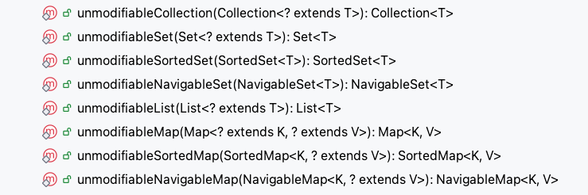

# 不可变对象

关于创建一个不可变的对象，经常使用的是String类。

当满足以下三个条件时，才可以说一个类的对象是不可变的对象：

- 不可变对象需要满足的条件
   - 对象创建以后其状态就不能修改
   - 对象所有域都是final类型
   - 对象是正确创建的(在对象创建期间，this引用没有逸出)
      - 将类声明未final，然后类就不可以被继承了
      - 将所有的成员声明为私有的，这样就不允许直接访问这些成员
      - 对变量不要提供setter方法，将所有可变的成员声明为final，这样只能对他们赋值一次，通过构造器促使把所有成员进行深度拷贝，在getter方法中，不要直接返回对象本身，而是克隆对象，并返回对象的拷贝

- final关键字：类、方法、变量
  - 修饰类：不能被继承。平常使用的String、Integer这些封装类都是final修饰的。final类中的成员变量可以根据需要设置为final，但是要注意的是final类中的所有成员方法都会被隐式的指定为final方法。
    - 在使用final修饰类的时候，需要谨慎选择，除非这个类真的在以后不会用来继承或者出于安全的考虑，尽量不要将类设计为final类。
  - 修饰方法：1、锁定方法不能被继承类修改；2、效率
    - 在《Java编程思想》中有一段话：使用final方法的原因有两个，第一个原因是把方法锁定，以防任何继承类修改它的含义；第二个原因是效率。在早期的Java实现版本中，会将final方法转为内嵌调用。但是如果方法过于庞大，可能看不到内嵌调用带来的任何性能提升。在最近的Java版本中，不需要使用final方法进行这些优化了。
    - 因此只有想明确禁止该方法在子类中被覆盖的情况下才将方法设置为final的。
    - 一个类的private方法会隐式的被指定为final方法。
  - 修饰变量：基本数据类型变量、引用类型变量
    - 修饰变量是final用的最多的地方，对于一个final变量，如果是基本数据类型的变量，那么它的数值一旦在初始化之后，便不能再修改了。如果是引用类型的变量，则在其初始化之后，便不能让它再指向另一个对象。

final修饰类直接看String类的实现即可，修饰方法，主要是锁定方法，不能被继承类修改，如果尝试修改，直接在编译阶段便会报错，重点是基本数据类型和引用类型变量的区别。

```java
/**
 * @author xiaoweii
 * @create 2025-03-04 22:48
 */
@Slf4j
@NotThreadSafe
public class ImmutableExample1 {

    private final static Integer a = 1;
    private final static String b = "2";
    private final static Map<Integer, Integer> map = Maps.newHashMap();

    static {
        map.put(1, 2);
        map.put(3, 4);
        map.put(5, 6);
    }

    public static void main(String[] args) {
//        a = 2;//编译时直接报错
//        b = "3";//编译时直接报错
//        map = Maps.newHashMap();//编译时直接报错
        map.put(1, 3);// 但是允许修改map当中的值
        log.info("{}", map.get(1));
    }

    private void test(final int a) {
//        a = 1;//编译时直接报错
    }
}
```

上述例子当中的map就极其容易引发安全问题。final在修饰一个引用类型的时候，只是不允许其指向其他对象，但是允许其中值发生改变。final修饰传入的变量，如果是基本数据类型也是不允许修改的。

除了final定义不可变对象，还有其他方法定义不可变对象：

- Collections.unmodifiableXXX()：Collection、List、Set、Map......
- Guava：ImmutableXXX：Collection、List、Set、Map......

```java
/**
 * @author xiaoweii
 * @create 2025-03-04 22:48
 */
@Slf4j
@NotThreadSafe
public class ImmutableExample2 {

    private static Map<Integer, Integer> map = Maps.newHashMap();

    static {
        map.put(1, 2);
        map.put(3, 4);
        map.put(5, 6);
        map = Collections.unmodifiableMap(map);
    }

    public static void main(String[] args) {
        map.put(1, 3);// 使用不可变Collections.unmodifiableMap(map)修饰之后，会直接抛出异常
        log.info("{}", map.get(1));
    }

}
```

异常：

```text
Exception in thread "main" java.lang.UnsupportedOperationException
	at java.util.Collections$UnmodifiableMap.put(Collections.java:1459)
	at com.xiaomaweii.example.immutable.ImmutableExample2.main(ImmutableExample2.java:28)
```

处理过后的map不允许再被修改。

```java
/**
 * Returns an unmodifiable view of the specified map.  This method
 * allows modules to provide users with "read-only" access to internal
 * maps.  Query operations on the returned map "read through"
 * to the specified map, and attempts to modify the returned
 * map, whether direct or via its collection views, result in an
 * <tt>UnsupportedOperationException</tt>.<p>
 *
 * The returned map will be serializable if the specified map
 * is serializable.
 *
 * @param <K> the class of the map keys
 * @param <V> the class of the map values
 * @param  m the map for which an unmodifiable view is to be returned.
 * @return an unmodifiable view of the specified map.
 */
public static <K,V> Map<K,V> unmodifiableMap(Map<? extends K, ? extends V> m) {
    return new UnmodifiableMap<>(m);
}
```

这个new UnmodifiableMap<>(m)在初始化之后，将更新的方法直接处理成抛出异常，这样将其处理为一个不可修改的map

看下Collections提供了那些不可变的方法：



