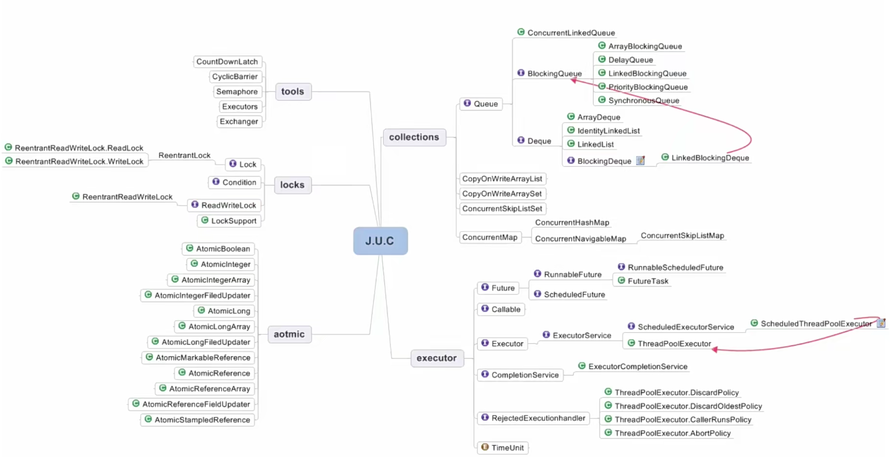

# 并发容器 J.U.C

java.util.concurrent

这里主要看并发容器里面提供的一些线程安全的集合和map，之后再来看并发容器提供的同步器——aqs

- ArrayList -> CopyOnWriteArrayList

CopyOnWriteArrayList，当有新元素添加到CopyOnWriteArrayList时，会先从原有的数组里拷贝一份出来，然后在新的数组上做写操作，写完之后，再将原来的数组指向新的数组。它的整个add操作都是在锁的保护下进行的，这么做，主要是为了避免在多线程并发做add操作的时候复制出多个副本出来，把数据搞乱了，导致最终的数组数据不是所期望的。

CopyOnWriteArrayList有几个缺点，第一是由于做写操作的时候，需要拷贝数组就会消耗内存，如果元素的内容比较多的情况下，可能会导致young
gc或者full
gc的频繁发生；第二是缺点是它不能用于实时读的场景，比如说数组拷贝，新增元素，都需要时间，所以调用一个set操作后，读取到的数据可能还是旧的，虽然CopyOnWriteArrayList能做到最终一致性，但是还是没法满足实时性要求。因此CopyOnWriteArrayList适合读多写少的场景，当然，如果无法保证CopyOnWriteArrayList到底要防止多少数据，也不知道到底要add或set多少次操作，那么这个类建议慎用。因为如果数据稍微有点多，每次更新操作的时候都要重新复述，这个代价可能会特别高昂，在高性能的互联网应用中，这种操作可能会分分钟引起故障。说了缺点，并不代表不好用，而是为了更好的去使用它，通常多个线程共享的例子不会很大，修改操作也会很少，因此，绝大情况下CopyOnWriteArrayList都很容易代替ArrayList满足线程安全。

经过分析，可以看出CopyOnWriteArrayList的设计思想，第一是读写分离，让读和写分开，第二是最终一致性，因为在CopyOnWriteArrayList的过程中，可能会有一些时间，它保证的是最终这个list的结果是对的。第三个思想，是使用时另外开辟空间，通过这种方式来解决掉并发冲突。最后CopyOnWriteArrayList读操作的时候，都是在原数组上读的，是不需要加锁的，而写操作时需要加锁，它为了避免多个线程并发修改，复制出多个副本出来，把数据搞乱。

CopyOnWriteArrayList的add方法

```java
/**
 * Appends the specified element to the end of this list.
 *
 * @param e element to be appended to this list
 * @return {@code true} (as specified by {@link Collection#add})
 */
public boolean add(E e) {
    final ReentrantLock lock = this.lock;
    lock.lock();
    try {
        Object[] elements = getArray();
        int len = elements.length;
        Object[] newElements = Arrays.copyOf(elements, len + 1);
        newElements[len] = e;
        setArray(newElements);
        return true;
    } finally {
        lock.unlock();
    }
}
```

CopyOnWriteArrayList的get方法

```java
/**
 * {@inheritDoc}
 *
 * @throws IndexOutOfBoundsException {@inheritDoc}
 */
public E get(int index) {
    return get(getArray(), index);
}
```

<hr>

- HashSet、TreeSet -> CopyOnWriteArraySet、ConcurrentSkipListSet

HashSet对应的并发容器为CopyOnWriteArraySet，TreeSet对应的并发容器为ConcurrentSkipListSet。

CopyOnWriteArraySet是线程安全的，底层实现是使用了CopyOnWriteArrayList，因此，它也适合于大小，通常是很小的一个set集合，然后只读操作远大于可变操作。因为它通常需要复制整个基础数组，所以对于可变的操作，包括add、set、remove等等，开销相对仍大一些，然后迭代器不支持可变的remove操作。它使用迭代器进行遍历的时候速度非常快，而且不会与其他线程发生冲突。

ConcurrentSkipListSet，是jdk6新增的类，和TreeSet一样，是支持自然排序的，并且，可以在构造的时候自己定义比较器，和其他set集合一样，ConcurrentSkipListSet它是基于map集合的，在多线程环境下，ConcurrentSkipListSet里面的content方法，add、remove操作都是线程安全的，多个线程可以安全的并发的执行插入、移出、访问操作。但是对于批量操作，addAll、removeAll、retainAll、containsAll并不能保证以原子方式执行。理由很简单，因为addAll、removeAll、retainAll这些方法，在底层调用的还是add、remove方法。在疲劳操作时，只能保证每一次的contents、add、remove的操作时原子性，代表的是在进行这三个操作时，不会被其他线程打断，但是不能保证每一次批量操作都不会被其他线程打断，在使用ConcurrentSkipListSet的批量操作时，还需要自己手动做一些同步操作，比如加锁保证同一时间内只允许一个线程调用批量操作。同时关于ConcurrentSkipListSet这个类，是不允许使用空元素的，即java当中的null，因为它无法可靠的将参数及返回值与不存在的元素区分开来。

<hr>

- HashMap、TreeMap -> ConcurrentHashMap、ConcurrentSkipListMap

ConcurrentHashMap时HashMap的线程安全版本，需要注意ConcurrentHashMap不允许有空值，否则会抛出空指针异常。在实际使用中，除了少数的插入操作和删除操作外，绝大部份我们使用map都是读操作，而且读操作在大多数都是成功的。基于这个前提，ConcurrentHashMap针对读操作做了大量的优化，因此这个类具有特别高的并发性，高并发经常在面试时会被提起，后面在介绍ConcurrentHashMap的实现原理。

ConcurrentSkipListMap时TreeMap的线程安全版本，内部使用skip
list这种跳表的结构来实现的。有人拿ConcurrentSkipListMap和ConcurrentHashMap做过性能测试，在四个线程1.6万条数据条件下，ConcurrentHashMap的存取速度是ConcurrentSkipListMap的四倍，但是ConcurrentSkipListMap它有几ConcurrentHashMap不能比拟的优点。第一个是ConcurrentSkipListMap，它的key是有序的，这个ConcurrentHashMap是做不到的。第二个是ConcurrentSkipListMap是支持更高的并发，存取时间是和线程数几乎没有关系的，也就是说在数据量一定的情况下，并发的线程越多，ConcurrentSkipListMap越能体现出它的优势来，在非多线程的情况下，尽量使用TreeMap。此外，对于并发性相对较低的并发程序，也可以使用Collections里面的类，它有一个方法叫做synchronizedSortedMap，它是将TreeMap进行包装，也可以提供较好的效率，对于高并发程序，应当使用ConcurrentSkipListMap提供更高的并发度，所以，在多线程程序中，如果需要对map的键值进行排序时，也尽量使用ConcurrentSkipListMap，可以看到更好的并发度。

<hr>

来看一下JUC的实际构成



# 安全共享对象策略 - 总结

- 线程限制：一个被线程限制的对象，由线程独占，并且只能被占有它的线程修改
- 共享只读：一个共享只读的对象，在没有额外同步的情况下，可以被多个线程并发访问，但是任何线程都不能修改它
- 线程安全对象：一个线程安全的对象或者容器，在内部通过同步机制来保证线程安全，所以其他线程无需额外的同步就可以通过公共接口随意访问它
- 被守护对象：被守护对象只能通过获取特定的锁来访问