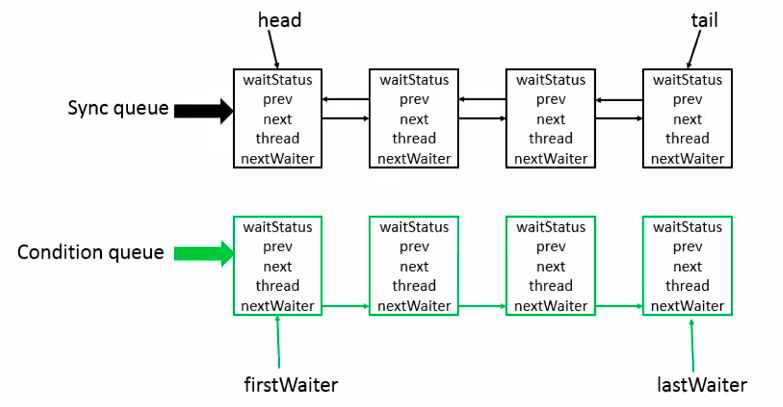

# JUC-AQS

## AbstractQueuedSynchronizer - AQS

### AQS底层数据结构

从jdk1.5开始，引入了并发包，java.util.concurrent，就是JUC，JUC大大提高了Java程序的并发性能，而AQS被认为是JUC的核心，JUC可以说是并发类里面重中之重。它提供了一个first in first out对立。这个队列，可以用来构建锁或者其他相关的同步装置的基础架构，。AQS这个类的底层数据结构，使用的是双向列表，是队列的一种实现，因此，也可以把它当作是队列，其中Sync queue就是同步队列，它是双向链表，包括head节点和tail节点。head节点主要是用作后续的调度。当中还有个Condition queue，不是必须的，它是一个单向链表，只有当程序中需要使用到Condition的时候，才会存在这个单向链表，并且可能会有多个Condition queue。

### AQS的设计

具体看下AQS的设计

- 使用Node实现FIFO队列，可以用于构建锁或者其他同步装置的基础框架
- 利用int类型的state表示同步状态，基于aqs的有一个同步组件叫做reentrantLock，在这个组件中的state，表示获取锁的线程数，加入state=0表示还没有线程获取锁，1表示已经有线程获取了锁，大于1表示存入锁的数量
- 使用方法是继承，aqs的设计是基于模板方法的，使用者需要继承这个aqs并复写其中的方法，此类需要通过继承并通过实现它的方法来管理状态的，对应的里面的acquire和release方法，就是获取锁和释放锁的方法
- 子类通过继承并通过实现它的方法管理其状态{acquire 和 release}的方法操作状态
- 可以同时实现排它锁和共享锁模式（独占、共享）。

aqs的功能主要分为两类，独占功能和共享功能，它的所有子类中，要么使用了共享锁的功能，要么使用了独占功能的api，不会同时使用两套api，即使通过两个内部类读锁和写锁，即使是最有名的子类reentrantLock，也是通过两个内部类读锁和写锁，分别实现了两套api来实现的。

### AQS具体实现大致思路

首先，aqs内部维护了一个clh队列来管理锁。线程会首先尝试获取锁，如果失败就将当前线程以及等待状态等信息包成一个node节点，加入到之前介绍的同步队列sync queue中，接着会不断的循环尝试获取锁，它的条件是当前节点为head的直接后继才会尝试，如果失败就会阻塞自己，直到自己被唤醒。而当持有锁的线程释放锁得到的时候，会唤醒队列中的后继线程。基于这些基础的设计和思路，jdk提供了许多基于aqs的子类，就是我们常用的那些同步的组件。

### 同步组件

- CountDownLatch
- Semaphore

这两个组件，是闭锁和信号量的实现。闭锁通过一个计数来保证线程是否需要一直阻塞，而信号量能控制同一时间并发的数目。

- CyclicBarrier

它和CountDownLatch很像，都能阻塞进程。

- ReentrantLock （重点）
- Condition
- FutureTask

等等