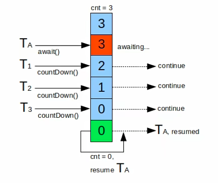

# CountDownLatch

## 基本概念

同步组件CountDownLatch，这个类特别重要

CountDownLatch是一个同步辅助类，通过它可以完成类似于阻塞当前线程的功能，换句话说就是一个线程或多个线程一直等待，直到其他线程执行的操作完成count，它用了一个给定的计数器来进行初始化，该计数器的操作是原子操作，就是同时只能有一个线程去操作该计数器，调用该类和wait方法的线程会一直处于阻塞状态，直到其他线程调用，countDown这个方法使当前计数器的值变为0，每次调用countDown的时候，计数器的值会减一。当计数器的值减到0的时候，所有因调用和微调方法而处于等待状态的线程就会继续往下执行，这种操作，只会出现一次，因为，这里的计数器是不能被重置的，如果业务上需要一个可以重置计数次数的版本，可以使用后面的CyclicBarrier。

## 使用场景

CountDownLatch这个同步组件的使用场景，在某些业务场景中，程序执行需要等待某个条件完成后才能继续执行后续的操作。典型的应用，比如并行计算。当某个处理的运算量很大时，可以将该运算任务拆分成多个子任务，等待所有的子任务都完成之后，父任务再拿到所有子任务的运算结果进行汇总，为什么并发模拟的时候可以使用CountDownLatch呢？

因为我们模拟的场景是有5000个请求，每一个分别去执行一个函数，测试给的函数实践起来比较简单，实际中执行的函数，可能会非常复杂，而且耗时。我们需要等待所有这些请求被处理完，再统计它的结果，这个结果对应我们演示时最终看到的计算结果，我们通过CountDownLatch就可以保证这些请求都被处理完才去输出最终的结果。过程中，每一个请求都可以看作是一个子任务，这个场景要理解明白。

这也是为什么一开始在并发模拟时就使用了CountDownLatch这个同步组件。