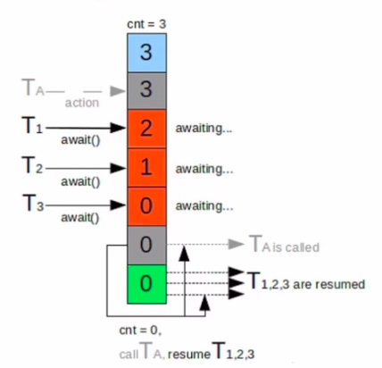

# CyclicBarrier

## 基本概念

aqs同步组件CyclicBarrier也是一个同步辅助类，它允许一组线程相互等待，直到达到某个公共的屏障点，用英文来说就是common barrier
point，通过它可以完成多个线程之间相互等待，只有当每一个线程都准备就绪后，才能各自继续往下执行后面的操作，它和CountDownLatch相似，都是通过计数器来实现的。当某个线程调用了await方法之后，该线程就进入了等待状态，而且计数器执行的是加1操作，这里图是从下往上看的，当计数器的值达到了设置的初始值的时候，因为调用await方法，进入等待状态的线程会被唤醒，继续执行它们后续的操作，由于这个CyclicBarrier在释放线程后可以重用，所以我们又称它为是循环屏障，它可以一直来循环使用。

## 使用场景

CyclicBarrier的使用场景和CountDownLatch类似，CyclicBarrier可以用于多线程计算数据，最后合并计算结果的应用场景。比如用一个excel保存了用户所有的银行流水，excel的每一页，保存了一个账户近一年的每一笔一行流水，现在，需要统计用户的日均银行流水，就可以先用多线程处理每个页里面的银行流水，都执行完之后，得到每一个月的日均银行流水之后呢，再通过CyclicBarrier的action，利用这些线程的计算结果，计算出整个excel的日均银行流水。

## CyclicBarrier和CountDownLatch区别

这里CyclicBarrier的图和CountDownLatch的图很相似，硬刺来看一下区别，首先第一点，CountDownLatch的计数器只能使用一次，而CyclicBarrier的计数器，可以使用reset方法重置循环使用。第二点，CountDownLatch它主要是实现一个或n个线程，需要等待其他线程完成某项操作之后才能继续往下执行，它描述的是1个或n个线程等待其他线程的关系，而CyclicBarrier主要是实现了多个线程之间相互等待，直到所有的线程都满足了条件之后，才能继续执行后续的操作，它描述的是各个线程内部互相等待的关系，就比如我们启动了多个线程，每个线程如果准备好了之后，就调用逻辑的方法在等着，比如之前设置的屏障是五个线程的时候，等待，如果五个线程都调用了await的方法，那么相当于它们都ready了，接下来才允许它们一起继续往下执行，所以CyclicBarrier它能处理更复杂的业务场景，比如说如果计算发生错误了，可以重置计数器，并让线程重新执行一次。

CyclicBarrier还提供了其他游泳的方法，比如getNumber，waiting方法可以获得CyclicBarrier阻塞的线程数量，还可以通过isBroken方法判断阻塞的线程是否被中断。