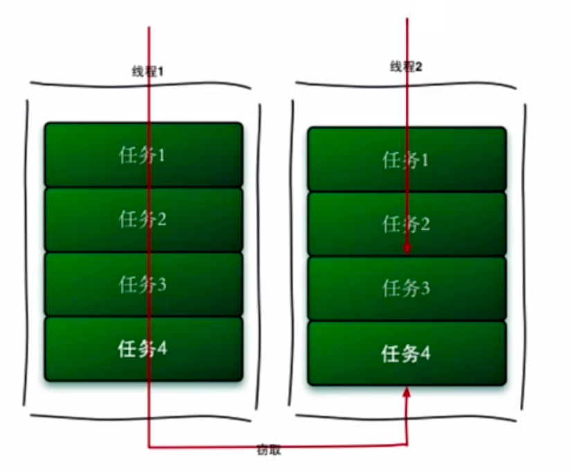

# Fork/Join 框架

Fork/Join时Java7提供的一个用于并行执行任务的框架，它是一个把大任务分割成小任务，最终汇总每个小任务结果后得到大任务结果的框架。思想和MapReduce非常类似。从字面上看Fork就是把一个大任务切分成若干个子任务并行执行。Join就是合并这些指令的执行结果，最后得到这个大任务的结果，它主要采用的是工作窃取算法。工作窃取算法是指某个线程从其他队列里窃取任务来执行。

为什么要使用工作窃取算法呢？加入我们需要做一个比较大的任务，我们可以把这个任务分割成若干个互不依赖的子任务，为了减少线程间的竞争，于是把这些子任务分别放到不同的队列里面，为每个队列创建一个单独的线程来执行队列里的任务。线程和队列一一对应，比如A线程负责处理A队列里的任务，但是有的线程会先把自己队列里的任务干完，而其他线程对应的队列里还有任务等待处理，干完活的线程，与其等着，还不如去帮其他线程干活，于是就去其他线程里的队列里窃取一个任务来执行，而在这时，它们会访问同一个队列，所以，为了减少窃取任务线程和被窃取任务线程之间的竞争，通常我们会使用的是双端队列，被窃取任务的线程永远从双端队列的头部拿任务执行，而窃取任务的线程永远从双端队列的尾部拿任务执行。这个工作窃取算法的优点，就是充分利用线程进行并行计算，并减少了线程间的竞争。它的缺点是在某些情况下还是存在竞争，比如双端队列中只有一个任务时，同时这样还消耗了更多的系统资源，比如创建了多个线程和多个双端队列。

对于Fork/Join框架而言，当一个任务正在等待它使用照样操作，创建的子任务结束时，执行这个任务的工作线程，查找其他未被执行的任务，并开始它的执行，通过这种方式的线程，充分利用它们的运行时间来提高应用程序的性能，为了实现这个目标，Fork/Join框架执行的任务有一些局限性。

首先，任务它只能使用Fork和Join操作来作为同步机制，如果使用了其他同步机制，让他们在同步操作时，工作线程就不能执行其他任务了。比如在Fork/Join框架中，使任务进入了睡眠，那么在睡眠期间内，正在执行这个任务的工作线程将不会执行其他任务了。第二个局限性是我们采用的任务，不应该去执行IO操作，读或写数据文件。第三个局限性是任务不能抛出检查异常，它必须通过必要的代码来处理他们。

Fork/Join框架的核心是两个类，包装了任务的ForkJoinTask，以及执行任务的ForkJoinPool。

ForkJoinPool它负责实现，包括刚才的工作窃取算法，它管理工作线程和提供关于任务的状态以及他们的执行信息，而ForkJoinTask则主要提供在任务中执行fork和join操作的机制。