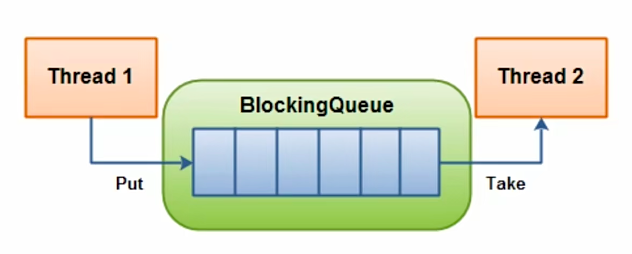
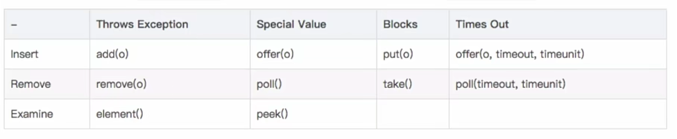

# BlockingQueue

BlockingQueue就是阻塞队列，从阻塞队列这个词上，就可以看出来，在某些情况下，对阻塞队列的访问可能会造成阻塞，被阻塞的情况主要有两种：

第一种是当队列满了的时候，进行入队列操作，第二种操作是当队列空了的时候，进行出队的操作。

因此当一个线程试图队一个已经满了的队列进行入队操作的时候，它将会阻塞，除非有另一个线程做了出队列的操作。同样，当一个线程试图对一个空队列，对它空的队列进行出队列操作的时候，它将会被阻塞，除非，有另一个线程进行了入队操作。

通过上面的描述阻塞队列特性，可以知道阻塞队列，应该是线程安全的。阻塞队列主要用在生产者和消费者的场景。上面的图，其实就是一个线程生产和消费的场景，负责生产的线程不断的制造新对象，并插入到阻塞队列中，直到达到这个队列的上限值，队列达到上限值之后，生产线程，它将会被阻塞，直到消费者线程，对这个队列开始消费。同理，负责消费的线程不断的从队列中消费对象，直到这个队列为空。当队列为空的时候，消费线程将会被阻塞，除非队列中有新的对象被插入进来。

阻塞队列，一共提供了四套方法，分别来进行常规插入、移出和检查，这是它们对应的四套方法。每套方法对应的操作不能马上执行时会有不同的反应，这个表格就是具体的说明，我们分别看一下，这四套方法各自的特点。

首先第一个是Throws exception，它的特点是如果不能马上进行就抛出异常，调用的是add、remove和element方法。第二套方法，是如果不能马上运行，就返回一个特殊的值，special value一般是true和false，对应的方法是offer、poll和peek。第三套方法，是blocks，它是如果操作不能马上运行的时候，操作就会被阻塞，调用对应的方法是put和take。第四套方法，是times out，如果操作不能马上进行的时候，操作会被阻塞指定的时间，如果指定时间还没有执行，则返回一个特殊值，一般是true或者false。

大家在使用BlockingQueue的时候一定要注意，我们希望使用那种情景这四套方法对应的给的函数名都不一样。稍微有一点相同的是这个special value和time out，这里面其实相当于是给我们之前的special value的方法加上了一个time out，其余的值，我们使用不同的方法，它们都会有不同的表现。需要注意的是，BlockingQueue这么多方法，就不一一演示，主要是看下BlockingQueue的一些实践类。

- ArrayBlockingQueue

首先第一个是ArrayBlockingQueue，它是一个有界的阻塞队列，内部实现是一个数组，有边界的意思是它的容量是有限的，必须在其初始化的时候指定它的容量大小，这个大小一旦指定了就不能再改变了。ArrayBlockingQueue，是以先进先出的方式存储数据，最新插入的对象是尾部，最新移出的对象是头部。

- DelayQueue

第二个是DelayQueue，它阻塞的是内部元素。DelayQueue中的元素必须实现一个接口，是JUC里面一个叫做Delay的接口，这个Delay的接口，它继承了Comparable接口，这个主要是因为DelayQueue中的元素需要进行排序，一般情况下我们都是按照元素过期时间的优先级进行排序。DelayQueue的应用场景有很多，比如定时关闭连接，缓存对象，超时处理等多种场景，DelayQueue内部实现其实用的是PriorityQueue和Lock，其实就是锁跟排序。

- LinkedBlockingQueue

LinkedBlockingQueue，这个队列它的大小配置是可选的，如果初始化时指定了一个大小，那么它就是有边界的，如果不指定，它就是无边界的，所以说，无边界其实就是使用了默认的最大的整型值。它的内部实现是一个链表，除了这个内部实现结构不一样，其他的大部分和ArrayBlockingQueue是一样的。LinkedBlockingQueue也是以先进先出的方式存储数据，最新插入的对象在尾部，最新移出的对象在头部。

- PriorityBlockingQueue

PriorityBlockingQueue，它是一个没有边界的队列，但是它是有排序规则的，需要注意的是，在这个PriorityBlockingQueue，是允许插入null，就是空对象。大家如果使用PriorityBlockingQueue一定要注意所有插入PriorityBlockingQueue的对象必须实现Comparable接口，队列的优先级的排序规则，就是按照我们对这个接口的实现来定义的，我们可以先从PriorityBlockingQueue中获得一个迭代器Iterator，但是这个迭代器并不保证按照我们优先级的顺序进行迭代。

- SynchronousQueue

SynchronousQueue，这个队列仅允许容纳一个元素，当一个线程插入一个元素后，就会被阻塞，除非这个元素被另一个线程消费，因此，我们又称它为同步队列，它是一个无界非缓存的队列，准确的说它不存储元素，放入元素，只有等待取走元素之后才能接着放入。

综上，可以看到BlockingQueue中有很多实例，每个实例有不同的特性，如果使用需要提前想好自己的场景，使用哪个实例实现最好。另外，BlockingQueue针对入队和出队，它提供了四套方法，分别有不同的表现，大家也需要根据实际场景决定调用哪个函数，由于它的组合情况比较多，所以使用的时候一定要小心。BlockingQueue不光实现了一个完整队列所具有的基本功能，同时，在多线程环境下，还自动管理了多线程间自动等待、唤醒功能，从而使得开发人员可以忽略这些细节，关注更高级的功能。

