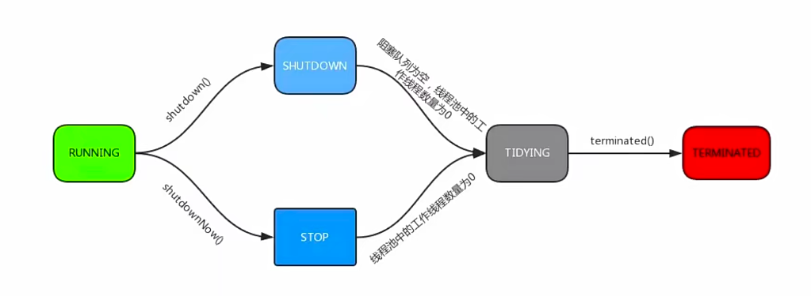
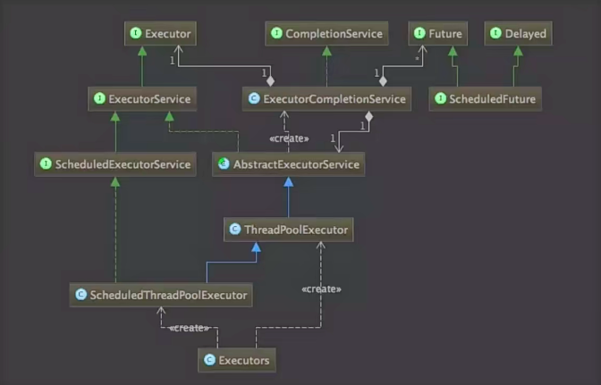

# 线程池

## Thread

Java当中的Thread这个类，就是线程的意思

### new Thread弊端

- 每次new Thread新建对象，性能差。
- 线程缺乏统一管理，可能无限制的新建线程，相互竞争，有可能占用过多的资源导致死机或者OOM。这里不单单是因为new Thread，而且可能因为一些程序的bug，甚至设计上的缺陷触发了不断的new Thread导致问题。
- 缺乏更多功能，如更多执行，定期执行，线程中断

同时，Thread当中存在很多方法，所有的理论包括开始、中断、唤醒看起来很容易，但是使用起来非常复杂，所以尽量避免直接使用new Thread。

## 线程池的好处

- 重用存在的线程，减少对象创建，消亡的开销，性能佳。
- 可有效控制最大并发线程数，提高系统资源的使用率，同时避免过多资源竞争，避免堵塞。
- 提供定时执行、定期执行、单线程、并发数控制等功能。

## 线程池 - ThreadPoolExecutor

看下ThreadPoolExecutor可以接受那些参数来做初始化

- corePoolSize：核心线程数量
- maximumPoolSize：线程最大线程数
- workQueue：阻塞队列，存储等待执行的任务，很重要，会对线程池运行过程产生重大影响。

关于这三个线程的关系，如果运行的线程数少于corePoolSize的时候，直接创建新线程来处理任务，即使线程池中的其他线程是空闲的，如果线程池中的线程数量大于等于这里的corePoolSize，且小于maximumPoolSize的时候，则只有当workQueue满了的时候才创建新线程去处理任务。如果设置corePoolSize和maximumPoolSize相等，那么创建线程池的大小是固定的，这个时候，如果有新任务提交，这里的workQueue还没满的时候，就把请求放入到workQueue当中，等待有空闲的线程，然后从这里面去取出任务进行处理。如果运行的性能大于maximumPoolSize的时候，这个时候，如果workQueue也已经满了，那么就会通过后面的拒绝策略的参数来指定策略去处理这个任务。所以，在任务提价的时候，它的顺序主要为三个，第一个看corePoolSize，这里面的corePoolSize如果小于它的时候，直接创建线程调用，接着看workQueue，最后看maximumPoolSize。

了解这三者关系之后，再来看workQueue，它是保存、等待执行的任务的一个阻塞队列，当提交一个新的任务到线程池以后，线程会根据当前线程池中正在运行着的线程的数量来决定该任务的处理方式。

处理方式一共有三种，分别是直接切换使用无界队列，或者使用有界队列，直接切换这种常用的队列就是之前提到阻塞队列当中的SynchronizedQueue。其中无界队列一般使用的是基于列表的阻塞队列LinkedBlockingQueue，如果使用这种方式呢，线程使用能够创建的最大线程数就是这里的corePoolSize，而这里的maximumPoolSize就不会起作用了。当线程启动，所有的核心线程都是运行状态的时候呢，这时一个新的任务提交之后就会放入等待队列当中。然后是workQueue为有界队列，workQueue为有界队列时，一般使用的是ArrayBlockingQueue，使用这种方式，可以将线程池的最大线程数量限制为maximumPoolSize，这样能够降低资源的消耗，但是这种方式使得线程池对线程调度变得更困难，因为我们线程池和队列容量都是有限的，所以，要想使用线程池处理任务和存储率达到一个相对合理的范围，又想使我们线程的调度相对简单，并且还能尽可能降低线程池对资源消耗，就需要合理的设置这两个数量。

最大线程数，如果想降低系统资源的消耗，包括CPU的使用率，操作系统资源的消耗，剩下的环境切换的开销等等，可以设置一个较大的队列容量和较小的线程池容量，这样会降低线程处理任务的存储量。如果我们提交的任务经常发生阻塞，可以考虑调用设置这里的线程最大数的方法来重新设置线程的容量。如果对接的容量设置比较小，通常需要把这个线程池容量设置大一点，这样CPU的使用率相对会高一些。但是如果线程池的容量设置的过大，在提交任务数量太多的情况下，并发量会增加，那么线程之间的调度就是一个考虑要的问题，这样反而有可能会降低处理任务的存储量。

- keepAliveTime：线程没有任务执行时最多保持多久时间终止

keepAliveTime，线程池维护线程所允许的空闲时间，当线程池中的线程数量大于刚才的corePoolSize的时候，如果这时没有新的任务提交，核心线程外的线程不会立即销毁，而是在这里等待，直到等待的时间超过了keepAliveTime的时间。

- unit：指定keepAliveTime的单位，如TimeUnit.SECONDS。
- threadFactory：线程工厂，用来创建线程。

threadFactory默认会有一个默认的工厂来创建线程，使用默认的工厂创建线程的时候会使新创建的线程具有相同的优先级，并且是非守护的线程，同时它也设置了线程的名称

- rejectHandler：当拒绝处理任务时的策略

rejectHandler拒绝策略，如果前面的workQueue对应的阻塞队列满了，并且没有空闲的线程时，这时还继续提交任务，我们就需要采取一种策略来处理这个任务，线程池一共提供了四种策略，第一种就是直接抛出异常，这个也是默认的策略，默认是直接抛出异常，第二种，使用调用者所在的线程来执行任务。第三种，是丢弃队列中最靠前的任务，并执行当前任务，相当于好久之前要执行的任务就不要了直接丢弃来执行当前任务。最后一种策略是直接丢弃这个任务。

```java
    /**
     * Creates a new {@code ThreadPoolExecutor} with the given initial
     * parameters.
     *
     * @param corePoolSize the number of threads to keep in the pool, even
     *        if they are idle, unless {@code allowCoreThreadTimeOut} is set
     * @param maximumPoolSize the maximum number of threads to allow in the
     *        pool
     * @param keepAliveTime when the number of threads is greater than
     *        the core, this is the maximum time that excess idle threads
     *        will wait for new tasks before terminating.
     * @param unit the time unit for the {@code keepAliveTime} argument
     * @param workQueue the queue to use for holding tasks before they are
     *        executed.  This queue will hold only the {@code Runnable}
     *        tasks submitted by the {@code execute} method.
     * @param threadFactory the factory to use when the executor
     *        creates a new thread
     * @param handler the handler to use when execution is blocked
     *        because the thread bounds and queue capacities are reached
     * @throws IllegalArgumentException if one of the following holds:<br>
     *         {@code corePoolSize < 0}<br>
     *         {@code keepAliveTime < 0}<br>
     *         {@code maximumPoolSize <= 0}<br>
     *         {@code maximumPoolSize < corePoolSize}
     * @throws NullPointerException if {@code workQueue}
     *         or {@code threadFactory} or {@code handler} is null
     */
    public ThreadPoolExecutor(int corePoolSize,
                              int maximumPoolSize,
                              long keepAliveTime,
                              TimeUnit unit,
                              BlockingQueue<Runnable> workQueue,
                              ThreadFactory threadFactory,
                              RejectedExecutionHandler handler) {
        if (corePoolSize < 0 ||
            maximumPoolSize <= 0 ||
            maximumPoolSize < corePoolSize ||
            keepAliveTime < 0)
            throw new IllegalArgumentException();
        if (workQueue == null || threadFactory == null || handler == null)
            throw new NullPointerException();
        this.acc = System.getSecurityManager() == null ?
                null :
                AccessController.getContext();
        this.corePoolSize = corePoolSize;
        this.maximumPoolSize = maximumPoolSize;
        this.workQueue = workQueue;
        this.keepAliveTime = unit.toNanos(keepAliveTime);
        this.threadFactory = threadFactory;
        this.handler = handler;
    }
```

## 线程池实例的几种状态



Running状态，它能接受新提交的任务，并且也能处理阻塞队列中的任务。

Shutdown状态，它属于关闭状态，当一个线程池实例处于Shutdown状态的时候，不能再接受新提交的任务，但却可以继续处理阻塞队列中已经保存的任务。在线程池属于Running状态时，调用shutdown方法的时候，会使线程池进入到该状态。

Stop状态，Stop状态的时候也不能接受新的任务，也不处理阻塞队列中的任务，这时Shutdown状态和Stop状态的区别。Stop状态不能再接受新任务，也不能处理阻塞队列中的任务，它会中断正在处理任务的线程。在线程池处于Running或Shutdown状态的时候，如果调用了shutdownNow方法，就会使线程池进入到该状态。

Tidying状态，这个状态，是如果所有的任务都已经终止了，这个时候，有效线程数为0，线程池会进入到该状态，之后调用terminate的方法进入到这里面。

Terminated状态，默认的特别明确的方法，什么也没有做，只是在这个方法执行完之后会进入到该状态，这些状态，自己不需要做特别的处理，它是线程池内部自己根据方法来定义线程池的状态的。

对这些有个印象即可。

## 线程池方法

### 基础方法

- execute()：提交任务，交给线程池执行

我们又了线程池实例之后，就需要把线程放到线程池里面调度，这个方法就是execute()方法。它是提交任务，这个线程持续执行。

- submit()：提交任务，能够返回执行结果 execute + Future

submit()方法跟execute()方法的相同点都是提交任务，但是如果想要返回结果，可以使用submit的方法，它相当于是execute方法加上了一个Future，相当于是可以通过Future来等待这个任务实际被执行，然后等到这个任务执行完，拿到它的结果继续处理。

下面是两个线程池关闭的方法：

- shutdown()：关闭线程池，等待任务都执行完
- shutdownNow()：关闭线程池，不等待任务执行完

它们俩都是关闭线程池，不同点在于shutdownNow方法是不等待任务执行完，直接就关闭掉了，会暂停正在执行的任务，

shutdownNow适用于什么情况呢？就比如现在不得不暂停所有的任务，要把线程池关闭掉，这种情况通常很少，一般，比如一个项目想重新启动的时候，通常也会用shutdownNow方法，要把任务全部执行，同时不再接受新的任务。

这四个方法是ThreadPoolExecutor中常用的基础功能。

### 监控方法

以下是适用于监控的方法

- getTaskCount()：线程池已执行和未执行的任务总数
- getCompletedTaskCount()：已完成的任务数量
- getLargestPoolSize()：线程池当前的线程数量
- getActiveCount()：当前线程池中正在执行任务的线程数量

通过线程池提供的这几个方法，对线程池的实例进行监控，那么怎么监控呢，比如我们可以选择每分钟去取出线程池实例的这些方法数据出来，来对线程池进行监控，一个比较简单的点的操作，我们可以定义一个空的类传入这个里面的ThreadPoolExecutor实例，然后每一分钟调用这个实例的四个方法，记录一下当时的数据，然后分析使用。实际项目当中可以把这些数据直接放到监控系统里，通过图表展示，这样的话，每一分钟这个线程池当前的这些数据就可以展示成一个图标。

## 线程池类图



之前使用的是Executors，最底层的类，这个Executors的框架，是根据一组执行策略的调用调度执行和控制异步任务的框架，目的是提供一种将任务提交与任务如何运行分离开来的机制。JUC里面，有三个Executor接口，分别是Executor、ExecutorService、ScheduledExecutorService。

分别看一下这三个接口：

Executor，它是一个运行新任务的一个简单接口，而ExecutorService它拓展了Executor接口，添加了一些用来管理执行器生命周期和任务生命周期的方法。 ScheduledExecutorService，它拓展了ExecutorService接口，支持Future和定期执行任务。

刚才的ThreadPoolExecutor，是这里面功能最强的，因为我们可以根据自己需要传入我们需要的参数以及指定任何策略。

## Executor框架接口

这个JUC框架是非常强大的，为了让我们使用的方便，它还提供了额外的方法。

- Executors.newCachedThreadPool()：创建一个可缓存的线程池，如果线程池长度超过了处理的需要，可以灵活回收空闲线程，如果没有可以回收的，那么就新建线程
- Executors.newFixedThreadPool(int)：创建一个固定大小的线程池，创建的是一个定长的线程池，可以控制最大并发数，超出的线程会在队列中等待
- - Executors.newScheduledThreadPool(int)：创建一个支持定时及周期性的任务执行的线程池，也是一个定长线程池
- Executors.newSingleThreadExecutor()：创建的是一个单线程化的线程池，只会用唯一的工作线程来执行任务，保证所有的任务按照指定顺序去执行，这个指定顺序我们可以指定它是按照先入先出或者优先级等等来执行

## 线程池-合理配置

- CPU密集型任务，就需要尽量压榨CPU，参考值可以设为NCPU+1
- IO密集型任务，参考值可以设置为2*NCPU

只是参考值，具体的设置，需要根据实际情况进行调整。可以先按照这个参考值来进行设置，然后观察任务运行情况和系统负载来进行适当调整。

<hr>

使用线程池主要是为了通用存在的线程，减少对象创建消亡，能有效的控制最大并发线程数，可以避免过多的资源竞争，避免堵塞。也可以定时执行单线程等控制性能执行性能比较好。当然，不代表就要随时随地拿出线程池来使用，一定要根据实际场景来分析使用，以及它的参数配置。

比如实际中，如果用一万多种量级的线程，去优化线程池会发现使用线程池消耗的时间还没有直接计算块，为什么会这样呢？当线程池每个任务都很小时，小到任务计算的时间和任务调度的时间已经很接近的时候，这时候如果用线程池，反而会格外慢，因为花在任务调度和任务管理的时间将会更多，线程池好用也容易使用，但是，一定要根据实际场景来使用。


